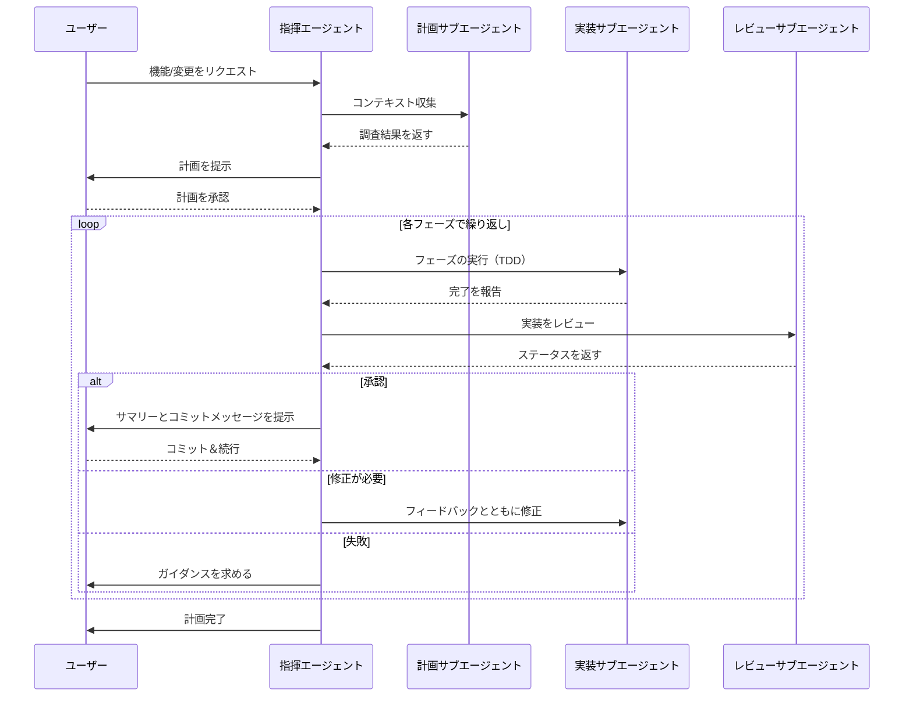

# GitHub Copilot Orchestra

> **AIアシスタンスによる構造化されたテスト駆動ソフトウェア開発のためのマルチエージェントオーケストレーションシステム**

## GitHub Copilot Orchestra とは？

「GitHub Copilot Orchestra」パターンは、AIエージェントによる開発方法を変革します。コンテキストの管理やモードの切り替えに追われる代わりに、Orchestraパターンは、機能追加や変更を行う際に、計画 → 実装 → レビュー → コミットという完全なAI開発サイクルを通じて、専門化されたAIサブエージェントを統括する構造化されたワークフローを提供します。

このシステムは、AI支援開発における重要な課題を解決します。それは、素早く動きながらもコード品質とテストカバレッジを維持することです。テスト駆動開発（TDD）の規約を強制し、各フェーズで品質ゲートを実装することで、AIコーディングのスピードとソフトウェアエンジニアリングのベストプラクティスを両立できます。

## 主な機能

- **🎭 マルチエージェントワークフロー** - 指揮エージェントが、計画・実装・コードレビューの各専門サブエージェントをオーケストレーション。それぞれの役割に最適化されています。
- **✅ TDD の強制** - 厳格なテスト駆動開発: 失敗するテストを書き、失敗を確認し、通過させるための最小限のコードを書き、成功を確認してから次へ進みます。
- **🔍 品質ゲート** - 各フェーズ後の自動コードレビューにより、次に進む前に基準が満たされていることを保証します。
- **📋 ドキュメントの証跡** - 包括的な計画ファイルとフェーズ完了記録が、完了した全作業を確認するための監査証跡を作成します。
- **⏸️ 必須停止ポイント** - 計画承認やフェーズコミットのためのビルトインの停止点により、開発プロセスの制御を維持できます。
- **🔄 反復サイクル** - 各実装フェーズは、次のフェーズに進む前に、実装 → レビュー → コミットの完全なサイクルに従います。
- **💎 コンテキストの簡潔さを維持** - 作業の大部分は、それぞれ独自のコンテキストウィンドウと専用プロンプトを持つ専門サブエージェントで実行されます。これにより、コンテキストウィンドウが埋まる際のハルシネーションの軽減に役立ちます。

## アーキテクチャ概要

Orchestraシステムは4つの専門エージェントで構成されています:

### 指揮エージェント（Conductor Agent）
- `Conductor.agent.md` - 完全な開発サイクルを管理するメインオーケストレーションエージェント。
    - 計画・実装・コードレビューのサブエージェントを統括。
    - 実行される計画を生成。
    - ユーザーインタラクションと必須停止ポイントを処理。
    - 計画 → 実装 → レビュー → コミットのサイクルを強制。
    - デフォルトでは Claude Sonnet 4.5 を使用。

### 計画サブエージェント（Planning Subagent）
- **`planning-subagent.agent.md`** - 調査とコンテキスト収集の専門家。
    - コードベースの構造とパターンを分析。
    - 関連するファイルと関数を特定。
    - 計画作成に役立つ構造化された調査結果を返す。
    - デフォルトでは Claude Sonnet 4.5 を使用。

### 実装サブエージェント（Implementation Subagent）
- **`implement-subagent.agent.md`** - TDD規約に従う実装の専門家。
    - 開発計画の個々のフェーズを実行。
    - まず失敗するテストを書き、次に通過させるための最小限のコードを書く。
    - フェーズの境界内で自律的に作業。
    - 信頼性の高い実装品質のため、デフォルトでは Claude Sonnet 4.5 を使用。
    - 代替: ルーチンのスキャフォールディングタスクには Claude Haiku 4.5 でより高速/低コスト。

### コードレビューサブエージェント（Code Review Subagent）
- **`code-review-subagent.agent.md`** - 品質保証の専門家。
    - gitを使用してコミットされていないコード変更をレビューし、新しいコードを特定。
    - テストカバレッジとコード品質を検証。
    - レビュー結果を指揮エージェントに返す（`APPROVED/NEEDS_REVISION/FAILED`）。
    - デフォルトでは Claude Sonnet 4.5 を使用。

## 前提条件

GitHub Copilot Orchestraを使用する前に、以下を確認してください:

- **VS Code Insiders** - サブエージェントへのタスク委譲を可能にするカスタムチャットモード機能に必要。
    - ダウンロード: https://code.visualstudio.com/insiders/

- **GitHub Copilot サブスクリプション** - AI搭載エージェントに必要なアクティブなサブスクリプション
    - Individual または Business プラン
    - GitHub Copilot Chat 拡張機能がインストールされ有効化されていること

- **Git** - バージョン管理はワークフローに不可欠
    - 各フェーズ終了時のコミットワークフローに使用
    - 推奨: gitコマンドの基本的な知識

## インストール

### 初期セットアップ

1. **リポジトリのクローンまたはダウンロード**
   ```bash
   git clone https://github.com/ShepAlderson/copilot-orchestra.git
   cd copilot-orchestra
   ```
   
   または、リポジトリをZIPファイルとしてダウンロードして任意の場所に展開するか、ブラウザからエージェントファイルの内容をコピーしてください。

2. **前提条件の確認**
    - 最新の VSCode Insiders がインストールされ実行されていることを確認。
    - GitHub Copilot Chat 拡張機能がアクティブであることを確認（サイドバーのチャットアイコンを確認）。
    - ワークスペースが git リポジトリであることを確認（`git status` を実行して確認）
        - そうでない場合、gitがインストールされていれば `git init` を使用できます。

### カスタムエージェントのセットアップ

GitHub Copilot Orchestraは、VSCode Insidersのカスタムチャットモードを使用してマルチエージェントワークフローを実現します。各 `.agent.md` ファイルが専門化されたAIエージェントを定義します。

1. **VSCode Insiders を開く** - ワークスペースディレクトリで
    ```bash
    cd /path/to/your/project
    code-insiders .
    ```

2. **エージェントファイルの確認** - リポジトリのルートディレクトリに4つの `.agent.md` ファイルがあります:
    - `Conductor.agent.md`
    - `planning-subagent.agent.md`
    - `implement-subagent.agent.md`
    - `code-review-subagent.agent.md`

3. **エージェントファイルのインストール**
    - **`.agent.md` ファイルをプロジェクトのルートディレクトリにコピー**
        - チーム間での共有に最適。
        - 個別のプロジェクトにスコープ。
    - **すべてのワークスペースで使用するために、ユーザーデータにカスタムエージェントをインストール**
        - VSCode Insidersで開くすべてのプロジェクトでカスタムエージェントが動作。
        - ファイルをユーザーデータの場所にコピー:
            - Mac の場合: `/Users/username/Library/Application Support/Code - Insiders/User/prompts` または同等のパス
        - **または:**
        - 手動セットアップ手順:
            - Copilot チャットの下部にあるチャットモードドロップダウンをクリック。
            - 「Configure Custom Agents」をクリック。
            - VSCode上部のコマンドドロップダウンで「Create new custom agent」をクリック。
            - 「User Data」を選択。
            - セットアップするファイル名を入力:
                - Conductor
                - planning-subagent
                - implement-subagent
                - code-review-subagent
            - このリポジトリのエージェントファイルの内容を、VSCodeで開いたファイルにコピー＆ペースト。

4. plans ディレクトリの作成
    - 指揮エージェントは進捗を追跡するためのドキュメントファイルを生成します。`plans/` ディレクトリを作成してください（または最初の計画ファイル書き込み時に指揮エージェントが自動作成します）:

        ```bash
        mkdir plans
        ```
    - このディレクトリには以下が保存されます:
        - コアタスク計画ドキュメント（`<task-name>-plan.md`）
        - フェーズ完了サマリー（`<task-name>-phase-<N>-complete.md`）
        - 最終タスク完了サマリー（`<task-name>-complete.md`）

**追加の設定は不要です** - エージェントは GitHub Copilot Chat インターフェースに自動的に表示されます。

## 指揮エージェントの使用方法

セットアップが完了したら、指揮エージェントを使い始められます:

**チャットモードドロップダウンから:**
- GitHub Copilot Chat を開く
- チャットパネルの下部にあるエージェントドロップダウンをクリック
- 利用可能なモードのリストから「Conductor」を選択

## 動作の仕組み

指揮エージェントは、すべての開発タスクに対して厳格な4段階サイクルに従います:

### 1. 計画フェーズ
- **ユーザーリクエスト** - 構築または変更したい内容を説明します。
- **調査の委譲** - `Conductor` が `planning-subagent` を呼び出し、コードベースに関する包括的なコンテキストを収集。
- **計画の作成** - `Conductor` が具体的な目標、変更するファイル、書くべきテストを含むマルチフェーズ計画（通常3〜10フェーズ）を作成。
- **計画の承認** - `Conductor` が停止し、実装開始前に計画をレビューして承認できます。
- **計画の文書化** - 承認された計画は `plans/<task-name>-plan.md` に保存。

### 2. 実装フェーズ（計画フェーズごとに繰り返し）
- **実装の委譲** - `Conductor` が `implement-subagent` を、特定のフェーズ目標と要件とともに呼び出す。
- **TDD の実行** - `implement-subagent` は厳格なテスト駆動開発に従う:
    - まず失敗するテストを書く。
    - テストを実行して失敗を確認。
    - テストを通過させるための最小限のコードを書く。
    - テストを実行して通過を確認。
    - リンティングとフォーマットを適用。
- **フェーズサマリー** - `implement-subagent` が完了を `Conductor` に報告。

### 3. レビューフェーズ（計画フェーズごとに繰り返し）
- **品質チェック** - `Conductor` が `code-review-subagent` を呼び出して実装を検証。
- **レビュー分析** - `code-review-subagent` が以下を検査:
    - テストカバレッジと正確性。
    - コード品質とベストプラクティス。
    - フェーズ目標への準拠。
- **ステータス判定**:
    - `Conductor` に以下のいずれかで返す:
        - `APPROVED` - コミットステップへ進む。
        - `NEEDS_REVISION` - 具体的なフィードバックとともに実装に戻る。
        - `FAILED` - 停止してユーザーにガイダンスを求める。

### 4. コミットフェーズ（計画フェーズごとに繰り返し）
- **フェーズサマリー** - `Conductor` が達成内容をユーザーに提示。
- **ドキュメント** - フェーズ完了ファイルが `plans/<task-name>-phase-<N>-complete.md` に保存。
- **コミットメッセージ** - `Conductor` が適切にフォーマットされた git コミットメッセージを生成。
- **必須停止** - ユーザーが git コミットを行い、続行の準備ができたことを確認。

**実装 → レビュー → コミットのサイクルが繰り返されます** 計画全体が完了するまで各フェーズで繰り返し、その後 `Conductor` が最終的な計画完了レポートを生成します。

### エージェント間のインタラクションフロー



## 使用例

完全なワークフローを示す現実的なシナリオです:

### シナリオ: ユーザー認証の追加

**初回リクエスト:**
```
Express APIにJWTベースのユーザー認証を追加したい。
ユーザーは登録、ログイン、保護されたルートへのアクセスができるようにしたい。
```

**1. 計画フェーズ**
- `Conductor` が `planning-subagent` に委譲して Express コードベースを分析。
- `planning-subagent` が既存のパターン、ミドルウェア構造、テストセットアップを特定。
- `Conductor` が5フェーズの計画を作成:
    1. ユーザーモデルとデータベーススキーマ。
    2. バリデーション付き登録エンドポイント。
    3. JWT生成付きログインエンドポイント。
    4. 認証ミドルウェア。
    5. 統合テストとエンドツーエンドテスト。

**2. 計画のレビューと承認**
- `Conductor` がユーザーに計画のドラフトを提示。ドラフトの末尾に「未確定事項」がある場合があります。以下のように回答してください:
    ```
    未確定事項への回答

    1. はい、パスワード暗号化にはbcryptを使用してください。
    2. ...
    ```

**3. 実装 → レビュー → コミットサイクル - フェーズ1**
- `Conductor` が「ユーザーモデルとデータベーススキーマ」のために `implement-subagent` を呼び出す。
- `implement-subagent`:
    - ユーザーモデルの失敗するテストを作成（バリデーション、パスワードハッシュなど）。
    - テストを実行して失敗を確認。
    - 最小限のコードでユーザーモデルを実装。
    - テストを実行して通過を確認。
    - リンティング/フォーマットを適用。
- `Conductor` が `code-review-subagent` を呼び出す。
- `code-review-agent` が `APPROVED` を返す。
- `Conductor` がサマリーとコミットメッセージをユーザーに提示:
    ```
    feat: パスワードハッシュ付きユーザーモデルを追加
    
    - email と password フィールドを持つ User スキーマを作成
    - 保存時の bcrypt パスワードハッシュを実装
    - email バリデーションとユニーク制約を追加
    - 包括的なユーザーモデルテストを作成
    ```
- **コミットを行い、チャットで「次のフェーズに進んでください」と指揮エージェントに伝える。**

**4. 残りのフェーズ**
残りの各フェーズでサイクルが繰り返されます:
- フェーズ2: 登録エンドポイント。
- フェーズ3: ログインエンドポイント。
- フェーズ4: 認証ミドルウェア。
- フェーズ5: 統合テスト。

各フェーズは **実装 → レビュー → コミット** サイクルに従います。

**5. 完了**
- 全フェーズが完了。
- `Conductor` が `plans/user-authentication-complete.md` を生成し、達成内容の完全なサマリーを記載。
- 機能は完全にテスト、レビュー、論理的な単位でコミットされます。

## 生成される成果物

Orchestraシステムは進捗を追跡し監査証跡を提供するためのドキュメントファイルを作成します。`plans` ディレクトリをコミットしたくない場合は `.gitignore` に追加するか、履歴記録としてコミットすることもできます。コミットする場合は、完了した計画を `plans/archived` に移動すると整理しやすくなります。

### 計画ファイル: `plans/<task-name>-plan.md`
ユーザーが計画を承認した後に作成されます。以下を含みます:
- タスクの概要と目標。
- ステップを含む完全なフェーズの内訳。
- 作成または変更するファイルと関数の提案。
- 書くべきテスト。
- ユーザーが回答する未確定事項と決定事項。
- ユーザーまたは `Conductor` が中断された場合に便利です。いつでもこれを参照して、`Conductor` に中断した箇所から再開させることができます。

**例:** `plans/user-authentication-plan.md`

### フェーズ完了ファイル: `plans/<task-name>-phase-<N>-complete.md`
各フェーズのコミット後に作成されます。以下を含みます:
- フェーズの目標とサマリー。
- 作成/変更されたファイル。
- 作成/変更された関数。
- 作成/変更されたテスト。
- レビューステータス。
- 使用された git コミットメッセージ。
- 中断によって計画の途中から実装サイクルを再開する必要がある場合、完了したフェーズドキュメントを確認して再開箇所のコンテキストを把握するよう指揮エージェントに指示できます。

**例:** `plans/user-authentication-phase-1-complete.md`

### 最終完了ファイル: `plans/<task-name>-complete.md`
全フェーズが完了した時に作成されます。以下を含みます:
- 完了した作業の全体サマリー。
- 完了した全フェーズ（チェックリスト）。
- 変更されたファイルの完全なリスト。
- 追加された主要な関数/クラス。
- テストカバレッジのサマリー。
- 次のステップの推奨事項。

**例:** `plans/user-authentication-complete.md`

**メリット（プロジェクトとともにコミットした場合）:**
- **監査証跡** - 何が構築され、なぜ構築されたかの完全な履歴。
- **ナレッジトランスファー** - 新しいチームメンバーが実装の決定を理解できる。
- **プロジェクトドキュメント** - 機能開発の自然なドキュメント。
- **レビュープロセス** - 各フェーズで何が変更されたかを簡単にレビュー。

## ヒントとベストプラクティス

### 指揮エージェントとの作業

- **リクエストは具体的に** - 技術スタック、既存のパターン、制約についてのコンテキストを提供してください。
    - 良い例: 「既存のPostgreSQLデータベースを使用して Express API にJWT認証を追加してください。`.env-dev` ファイルの開発用データベース接続文字列を使用できます。」
    - 改善の余地がある例: 「認証を追加して。」

- **計画を慎重にレビュー** - 計画フェーズは実装をガイドするチャンスです。
    - フェーズのスコープが適切かチェック。
    - テスト要件が自分の基準に合っているか確認。
    - 不明な点があれば質問。

- **頻繁にコミット** - フェーズ間のコミットステップをスキップしないでください。
    - 各フェーズは個別にコミット可能に設計されています。
    - 小さなコミットはレビューしやすく、必要に応じてリバートも容易。
    - 機能開発の明確な履歴を作成。
    - `code-review-agent` はレビュー対象として未コミットのコードを探します。

### 品質の最大化

- **TDDプロセスを信頼する** - テストファーストは遅く感じるかもしれませんが、問題を早期に発見し、AIエージェントによる実装のための明確なガイドレールを提供します（テスト自体がAIエージェントによって書かれた場合でも）。
    - 失敗するテストは、正しい動作をテストしていることを確認します。
    - 最小限のコードは実装を焦点に保ちます。
    - 通過するテストは次に進む自信を与えます。

- **レビューに注意を払う** - `code-review-subagent` は重要な問題を検出します。
    - ステータスが `NEEDS_REVISION` の場合、フィードバックは `Conductor` に戻され、問題を修正するための新しい `implement-subagent` が開始されます。
    - `FAILED` ステータスはアプローチの再評価のシグナルとして使用してください。`Conductor` がユーザーに戻り、次に何をすべきか確認します。

- **ドキュメントを活用する** - フェーズ完了ファイルは価値のある成果物です。
    - コミット前にレビュー。
    - PRの説明やディスカッションに使用。

### パフォーマンスの最適化

- **フェーズを焦点化する** - 小さなフェーズはより速く完了し、反復回数も少なくなります。
    - フェーズが大きすぎると感じたら、指揮エージェントに分割を依頼。
    - 可能であれば、フェーズあたりの変更ファイルを1〜3に抑える。

- **良いコンテキストを提供する** - `planning-subagent` が関連コードを見つけやすくする。
    - 知っている場合は具体的なファイルやディレクトリを言及し、AIチャットで明示的なコンテキストとして添付。
    - 従うべき既存パターンを参照。
    - 制約や要件を事前に伝える。

- **適切なモデルを使用する** - デフォルトのエージェント設定は品質/コストのバランスに最適化されています。
    - 指揮エージェント: Claude Sonnet 4.6（オーケストレーションと計画の調整）
    - 計画: Claude Sonnet 4.6（プロジェクト概要と計画用データの収集）
    - 実装: GPT-5.3-Codex（テストとコードの信頼性の高い実装）
    - レビュー: GPT-5.4（徹底的な分析とコードレビュー）
    - 別のモデルを使用したい場合は `.agent.md` ファイルでカスタマイズできます。ファイル上部のモデルを変更するだけです。（VSCodeが利用可能なモデルをオートコンプリートします。`:` の後を削除して再度 `:` を入力すると、ドロップダウン選択が表示されます。）
    - 指揮エージェントには、非常に複雑なマルチフェーズタスクのオーケストレーション時に Claude Opus 4.6 を検討してください。
    - ルーチンのスキャフォールディング実装には、Claude Haiku 4.5 で品質を維持しながらコストを削減できます。

## ニーズに合わせた GitHub Copilot Orchestra の拡張

### エージェントのカスタマイズ

各エージェントは変更可能な `.agent.md` ファイルで定義されています:

**AIモデルの調整:**
- 他のモデルに変更可能。
- VSCode Insidersで利用可能なモデル（2026年3月時点; 利用可能なモデルは変更される場合があります）:
    - `Auto (copilot)`
    - `Claude Opus 4.6 (copilot)` — プランニングや複雑なタスクのオーケストレーションに最適
    - `Claude Sonnet 4.6 (copilot)` — バランスの取れた品質とコスト
    - `Claude Haiku 4.5 (copilot)` — ルーチンタスク向けの高速・低コスト    
    - `GPT-5.4 (copilot)` — 最高品質の実装とレビュー向け 推奨デフォルト
    - `GPT-5.3-Codex (copilot)` — コード生成に特化したモデル
    - `GPT-5.4-mini (copilot)` — 軽量モデル、低コストで高速な応答        

**指示の変更:**
- メインセクションを編集してエージェントの動作を変更、新しいルールを追加、またはプロジェクト固有の規約を適用できます。

**カスタムツールの追加:**
- エージェントは様々なツール（ファイル操作、ターミナルコマンドなど）にアクセスできます。ツールの利用可能性はVS Codeで管理されますが、指示の中でガイダンスを提供できます。MCPサーバーを使用している場合は追加もできます。（`context7` のセットアップをお勧めします。サブエージェントファイルで言及されており、セットアップ後にサブエージェントファイルの `tools` に追加できます。）
- **注意:** `githubRepo` ツールは最近のVS Code Insidersアップデートで非推奨になりました。GitHub機能はMCPツール（例: GitHub MCPサーバー）を通じて利用可能です。GitHub連携が必要な場合はMCPサーバーを設定してください。

### 新しいサブエージェントの作成

ワークフローに合わせた専門サブエージェントを作成できます:

1. **新しい `.agent.md` ファイルを作成**（例: `database-migration-subagent.agent.md`）。
2. **既存のエージェントをテンプレートとして使用**し、エージェントの役割と指示を定義。
3. **指揮エージェントを更新**して、適切な箇所で新しいサブエージェントを呼び出すようにする。
4. **サンプルタスクで統合をテスト**。

**サブエージェントのアイデア:**
- **deployment-subagent** - デプロイ設定の専門家。
- **security-audit-subagent** - セキュリティ分析に特化。
- **performance-optimization-subagent** - コードパフォーマンスの最適化。
- **documentation-subagent** - 包括的なドキュメントの生成。

## ライセンス

MIT License

Copyright (c) 2025 Shep Alderson

Permission is hereby granted, free of charge, to any person obtaining a copy
of this software and associated documentation files (the "Software"), to deal
in the Software without restriction, including without limitation the rights
to use, copy, modify, merge, publish, distribute, sublicense, and/or sell
copies of the Software, and to permit persons to whom the Software is
furnished to do so, subject to the following conditions:

The above copyright notice and this permission notice shall be included in all
copies or substantial portions of the Software.

THE SOFTWARE IS PROVIDED "AS IS", WITHOUT WARRANTY OF ANY KIND, EXPRESS OR
IMPLIED, INCLUDING BUT NOT LIMITED TO THE WARRANTIES OF MERCHANTABILITY,
FITNESS FOR A PARTICULAR PURPOSE AND NONINFRINGEMENT. IN NO EVENT SHALL THE
AUTHORS OR COPYRIGHT HOLDERS BE LIABLE FOR ANY CLAIM, DAMAGES OR OTHER
LIABILITY, WHETHER IN AN ACTION OF CONTRACT, TORT OR OTHERWISE, ARISING FROM,
OUT OF OR IN CONNECTION WITH THE SOFTWARE OR THE USE OR OTHER DEALINGS IN THE
SOFTWARE.

---
